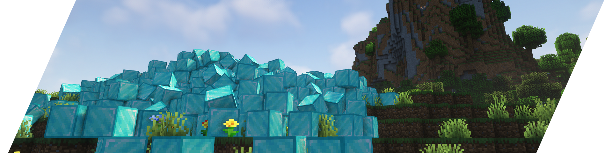

# Rattle

Generic physics engine framework for Minecraft servers

### [GitHub](https://github.com/aecsocket/rattle) · [Docs](https://aecsocket.github.io/rattle) · [Dokka](https://aecsocket.github.io/rattle/dokka)

Rattle is an integration project which combines a fully-featured physics engine backend into a server-side environment,
allowing a game world's state (blocks, entities, etc.) to influence the physics state, and allow that physics state to be
displayed to clients via vanilla packets (no client mod required).

The project currently uses the [Rapier](https://github.com/dimforge/rapier) backend, a rigid-body physics library,
with Java bindings via [rapier-ffi](https://github.com/aecsocket/rapier-ffi)'s `rapier-java` module, and integrated in
the `rattle-rapier` module.

**This project requires Java 19, and the `--enable-preview` `--enable-native-access=ALL-UNNAMED` flags!** 

## Features

- [x] Rigid body physics and collision detection
- [x] Integration with the world, so terrain and entities are automatically included as collision shapes
- [x] Fully server-side compatible; no client mods required
- [x] Compatible with Paper, Folia and Fabric
- [x] Free and open-source under the MIT license

## Motivation

Minecraft is a game that does not have advanced 3D physics - the limits of what it can do is basically ray-tests and
simple AABB collision response. However, physics simulations are really cool, and having it integrate cleanly with the
world would be even more impressive.

The code is implemented as generically as possible to run on the server-side rather than the client-side,
because it means that:
- all calculations happen on a single consistent environment
- clients don't need to download any mods for a mod loader (Forge, Fabric etc.) to interact with physics

There have already been projects which integrate some degree of rigid-body physics into the game, however those are mainly
used for one-off specific features, and most are client-side mods. Rattle acts instead as a framework for other projects
to use to integrate physics into a world.

## Installation

There are currently no plugin JARs available.
